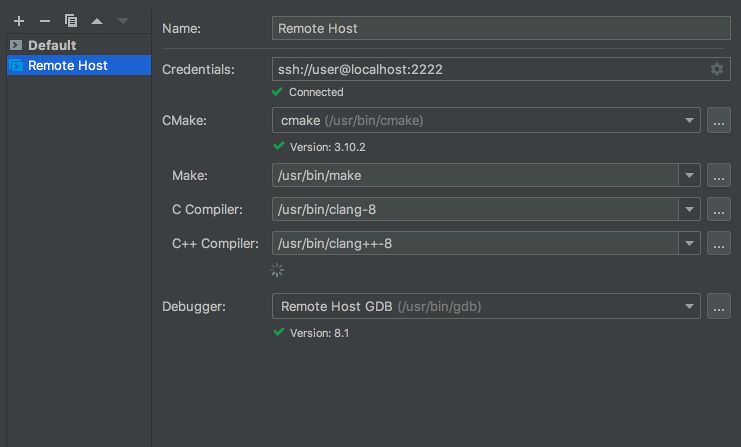
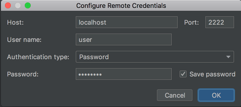
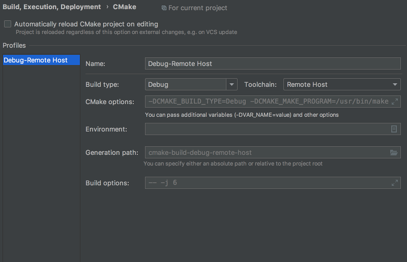

# Контейнер для курса

Работоспособность проверена на Ubuntu 18.04.
На версиях старее поддержка не гарантируется

## Зависимости
- `docker`
- `docker-compose`
- `bash`

## Начинаем

Linux:

```shell
sudo apt install -y docker docker-compose bash
sudo groupadd docker
sudo usermod -aG docker $USER
```

После этого потребуется перезапустить текущую сессию (или просто перезагрузить машину).

OS X:

Скачайте, установите и запустите [Docker Desktop](https://download.docker.com/mac/stable/Docker.dmg)

## Создание контейнера
Перейдите в папку `tpcc-course-2020/docker` и выполните следующую команду:
```shell
bash create.sh
```

## Логин в контейнер
Запустите `bash login.sh`

Логиниться в контейнер необходимо для работы с клиентом,
редактировать файлы можно и снаружи (для этого рекомендуется CLion, см. ниже).

Файлы, связанные с курсом на контейнере лежат в `/tpcc/`.

Работайте с контейнером под тем пользователем, под которым проводили установку!

## Выход из контейнера

Для выхода из контейнера нужно выполнить команду `exit`.

## Перезапуск контейнера
Запустите `bash restart.sh`

Может быть полезно, если вы выключите компьютер/исчезнет контейнер/случится еще какая-то магия

## Полезные заметки
Пользователь `user` сделан для интеграции с CLion, не логиньтесь в него специально в ручном режиме.
У этого пользователя может не быть прав на изменение/использование `/tpcc/` и он не предназначен для этого.
Логинтесь за текущего пользователя используя секцию "Логин в контейнер".

## Интеграция с CLion

### Настройка Remote Host

- Убедитесь, что контейнер запущен:
  ```
  docker container list | grep tpcc
  ```
- В CLion:
  1. Откройте проект `tpcc-course-2020`
  2. В `Preferences` > `Build, Execution, Deployment` > `Toolchains` создайте Remote Host:
  
  
  
  ```
  username: clion_user
  password: password
  ```
  
  

  3. В `Preferences` > `Build, Execution, Deployment` > `CMake` выберите `Toolchain` – созданный выше Remote Host:
  
  

### Работа с консольным клиентом из CLion

В окошке `Terminal` удобно залогиниться в докер-контейнер и звать оттуда команду `tpcc` для запуска тестов и т.п.
